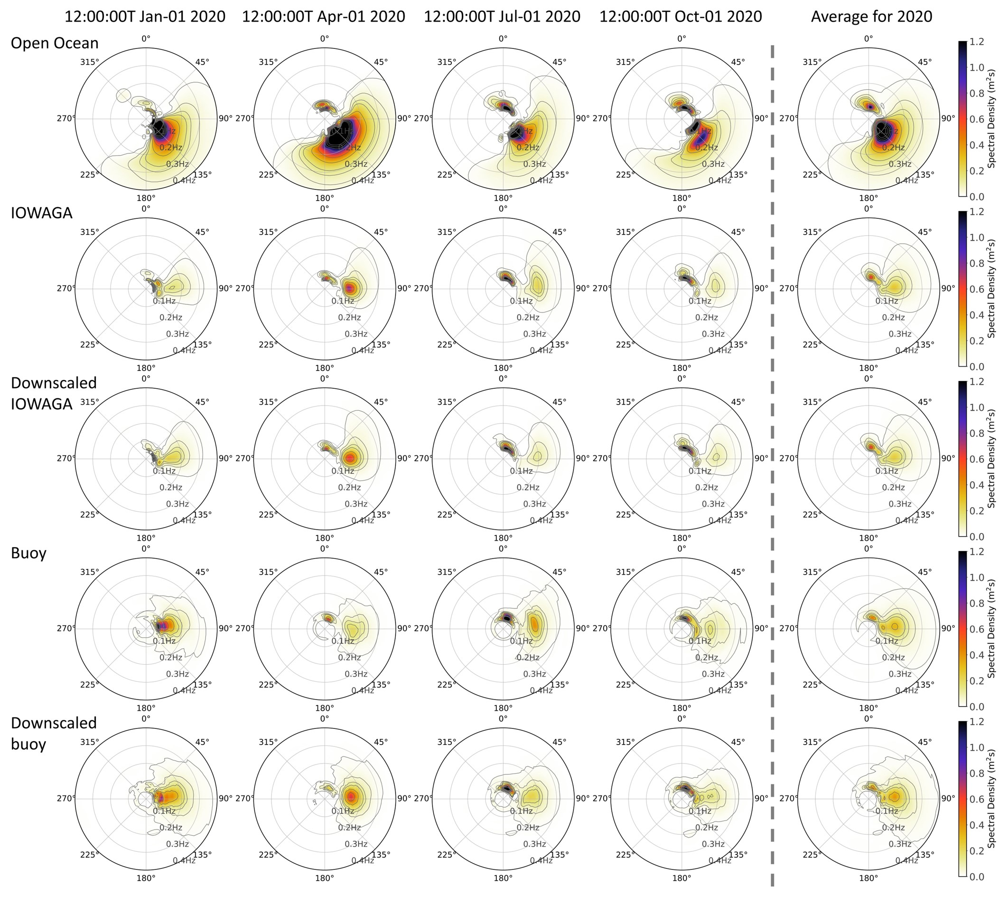

# README

This is the official implementation of the paper "Statistical Downscaling of Coastal Directional Wave Spectra Using Deep Learning" by [Tianxiang Gao](https://github.com/oaeen), [Haoyu Jiang](https://orcid.org/0000-0002-3995-7382)).

## Abstract
The modelling of coastal Directional Wave Spectra (DWSs) often requires downscaling techniques integrating DWSs from open ocean boundaries. Dynamic downscaling methods reliant on numerical wave models are often computationally expensive. In coastal areas, wave dynamics are strongly influenced by the bathymetry, implying that once the DWSs at the open ocean boundary are known, the DWSs at various locations along the coast are almost determined. This property can be utilized for statistical downscaling of coastal DWSs. This study presents a deep learning approach that can compute coastal DWSs from open ocean DWSs. The performance of the proposed downscaling model was evaluated using both numerical wave model data and buoy data in the Southern California Bight. The results show that the deep learning approach can effectively and efficiently downscale coastal DWSs without relying on any predefined spectral shapes, thereby showing potential for coastal wave climate studies.




## How to Use

### Requirements

use requirements.txt to install the required packages
```bash
pip install -r requirements.txt
```

### Data Preprocessing

#### Download Data

The data used in this study is available at [IFREMER](https://www.umr-lops.fr/Donnees/Vagues), [CDIP](https://cdip.ucsd.edu/).

#### Extract and Scale Data

Data can be extracted and scaled using the scripts in utils/preprocess.

#### Train the Model

The model can be trained using the script in 'run_all_params.py'. Experiment parameters can be adjusted within the Config class to tailor the training process to specific needs.


#### Test the Model

To test the model, we provide a preprocessed dataset and a pretrained model. After downloading the dataset and model from [Google Drive](https://drive.google.com/drive/folders/1G8kWkHizY71Tt8QeP5ObIRJRiF-11pnv), modify the data storage location in the Config class. Testing can be performed using the run_all_params.py script by setting eval=True and train=False. This setup ensures that the model runs in evaluation mode using the preloaded data and model parameters.

## Note on Experimental Results
Due to code clean-up efforts, the experimental results obtained with this implementation might differ from those presented in the original paper.

## Code
The code is available at [Coastal-DWS-Downscale](https://github.com/oaeen/Coastal-DWS-Downscale).